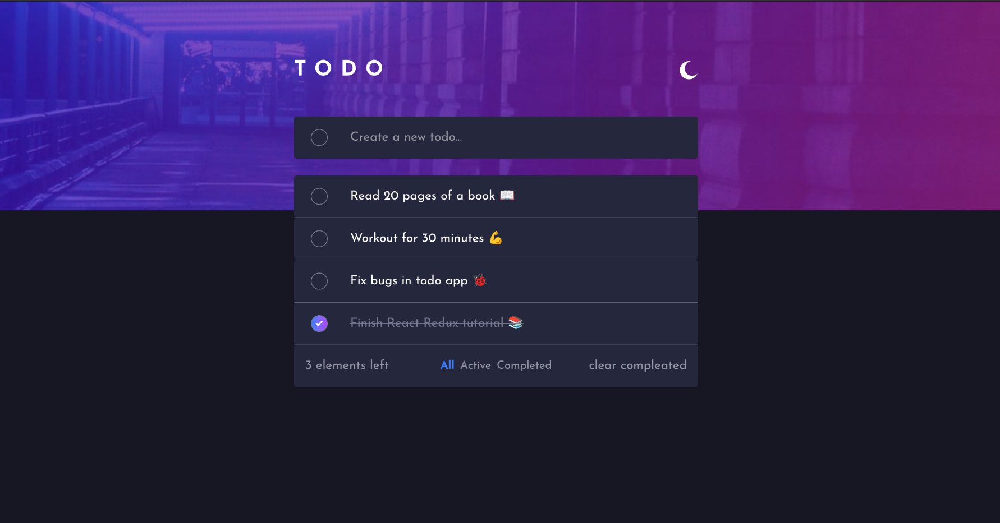

# 📝 React Todo App with Theme Toggle & Redux Toolkit

A modern and minimalist Todo app built with **React**, **TypeScript**, **Redux Toolkit**, and **Tailwind CSS**. Includes full **CRUD functionality**, **filtering**, **theme toggle**, and **localStorage persistence**.



## 🚀 Features

- ✅ Add, edit, complete, and delete todos
- 🎯 Filter todos by status: All / Active / Completed
- 🌙 Light & Dark theme toggle (persists)
- 💾 State persistence with localStorage
- ⚛️ Built with React + Redux Toolkit
- 💅 Styled using Tailwind CSS
- 🔒 Type-safe with TypeScript

## 🧱 Tech Stack

- [React](https://reactjs.org/)
- [TypeScript](https://www.typescriptlang.org/)
- [Redux Toolkit](https://redux-toolkit.js.org/)
- [Tailwind CSS](https://tailwindcss.com/)

## 📂 Folder Structure

## 🛠️ Getting Started

### 1. Clone the repo

```bash
git clone https://github.com/your-username/todo-app.git
cd todo-app
```

### 2. Install dependencies

```bash
npm install
```

### 3. Run the app

```bash
npm run dev
```

### 4. Build for production

```bash
npm run build
```

## 🙌 Acknowledgements

This app was inspired by the [Frontend Mentor Todo App Challenge](https://www.frontendmentor.io/challenges/todo-app-Su1_KokOW).

## 📄 License

This project is open-source under the [MIT License](LICENSE).

Built with ❤️ by [Your Name](https://github.com/sifenfisaha)
